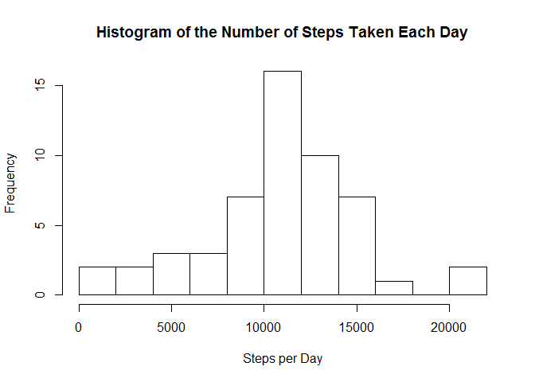
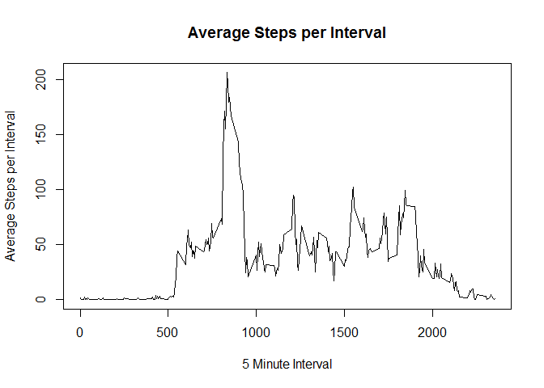
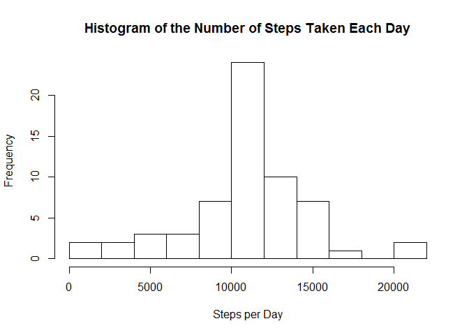
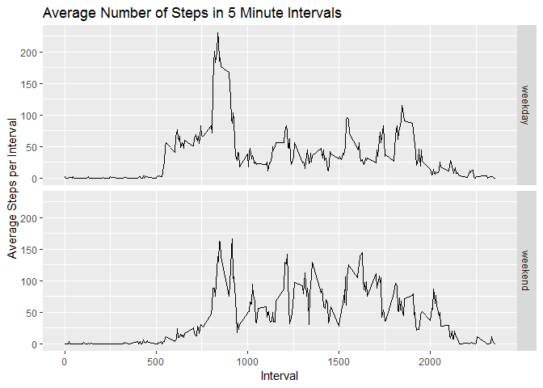

## Loading and preprocessing the data

First, we load the `csv` file from the `zip` file. Next, we 
convert the date from a string to a `POSIXlt`.

```r
options(scipen=999)
setwd("~/Coursera/repos/RepData_PeerAssessment1")
data <- read.csv(unz('activity.zip', 'activity.csv'))
data$date <- strptime(data$date, '%Y-%m-%d')
head(data)
```

```
##   steps       date interval
## 1    NA 2012-10-01        0
## 2    NA 2012-10-01        5
## 3    NA 2012-10-01       10
## 4    NA 2012-10-01       15
## 5    NA 2012-10-01       20
## 6    NA 2012-10-01       25
```


## What is mean total number of steps taken per day?


```r
data.nona <- data[!is.na(data$steps),]
steps_per_day <- tapply(data.nona$steps, as.character(data.nona$date), sum)
steps_per_day <- steps_per_day[!is.na(steps_per_day)]
hist(steps_per_day, 
     breaks=10, 
     main='Histogram of the Number of Steps Taken Each Day',
     xlab='Steps per Day')
```

<!-- -->

```r
mean_steps_per_day <- mean(steps_per_day)
median_steps_per_day <- median(steps_per_day)
```

The mean of steps per day is 10766.1886792.  The median number of steps per day is 10765.


## What is the average daily activity pattern?

```r
interval_average <- tapply(data.nona$steps, data.nona$interval, mean)
interval_name <- as.numeric(names(interval_average))
plot(interval_name, interval_average, 
     type='l',
     main='Average Steps per Interval',
     xlab='5 Minute Interval',
     ylab='Average Steps per Interval')
```

<!-- -->

```r
max_mean_interval <- interval_name[which.max(interval_average)]
max_mean_steps_per_interval <- max(interval_average)
```

The 5 minute interval, across all days, that, on average, has the maximum number of steps is interval 835 with 206.1698113 steps.


## Imputing missing values

```r
total_rows_with_na <- nrow(data[is.na(data$steps),])
```

The total number of rows with `NA` is 2304.


```r
data$filledsteps <- NA
for(i in 1:nrow(data)){
  if(is.na(data[i,]$steps)){
    data[i,]$filledsteps <- interval_average[match(data[i,]$interval, interval_name)]
  }
  else{
    data[i,]$filledsteps <- data[i,]$steps
  }
}
rm(i)
head(data)
```

```
##   steps       date interval filledsteps
## 1    NA 2012-10-01        0   1.7169811
## 2    NA 2012-10-01        5   0.3396226
## 3    NA 2012-10-01       10   0.1320755
## 4    NA 2012-10-01       15   0.1509434
## 5    NA 2012-10-01       20   0.0754717
## 6    NA 2012-10-01       25   2.0943396
```


```r
steps_per_day <- tapply(data$filledsteps, as.character(data$date), sum)
hist(steps_per_day, 
     breaks=10, 
     main='Histogram of the Number of Steps Taken Each Day',
     xlab='Steps per Day')
```

<!-- -->

```r
mean_steps_per_day <- mean(steps_per_day)
median_steps_per_day <- median(steps_per_day)
```

The mean of steps per day is 10766.1886792.  The median number of steps per day is 10766.1886792.

In the histogram, the frequency of days with 10000+ steps increased from approximately 16 to approximately 22. This is because the average total steps per day is 10766. By filling in the `NA` values with interval means, I've increased the frequency of days with 10000+ steps.

On the other hand, the mean did not change, as I used the interval mean to fill in `NA`. The median did change from 10765 to 0766.1886792 (the average number of steps per day).


## Are there differences in activity patterns between weekdays and weekends?

The function `formatdata$date, '%u')` changes the `POSIXlt` date into an integer representing the weekday with Monday being 1. So, `format(data$date, '%u') %in% c(6,7)` returns `TRUE` if it's the weekend and `FALSE` otherwise.


```r
data$day_type <- as.factor(ifelse(format(data$date, '%u') %in% c(6,7), 'weekend', 'weekday'))
head(data)
```

```
##   steps       date interval filledsteps day_type
## 1    NA 2012-10-01        0   1.7169811  weekday
## 2    NA 2012-10-01        5   0.3396226  weekday
## 3    NA 2012-10-01       10   0.1320755  weekday
## 4    NA 2012-10-01       15   0.1509434  weekday
## 5    NA 2012-10-01       20   0.0754717  weekday
## 6    NA 2012-10-01       25   2.0943396  weekday
```


```r
library(ggplot2)
interval_average <- tapply(data$filledsteps, list(data$interval, data$day_type), mean)
interval_average <- as.data.frame.table(interval_average)
names(interval_average) <- c('interval', 'day_type', 'mean_steps')
interval_average$interval <- as.numeric(as.character(interval_average$interval))
ggplot(interval_average, aes(x=interval, y=mean_steps)) + 
  geom_line() +
  facet_grid(rows=vars(day_type)) +
  ggtitle('Average Number of Steps in 5 Minute Intervals') +
  xlab('Interval') +
  ylab('Average Steps per Interval')
```

<!-- -->
